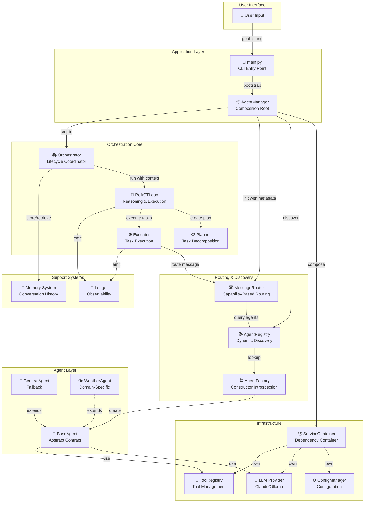
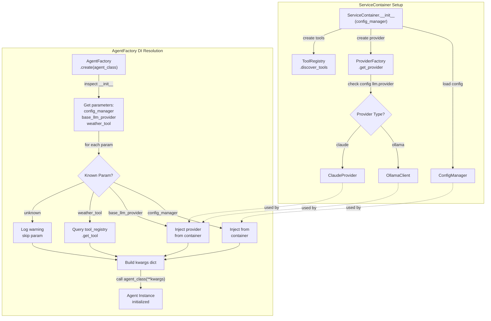
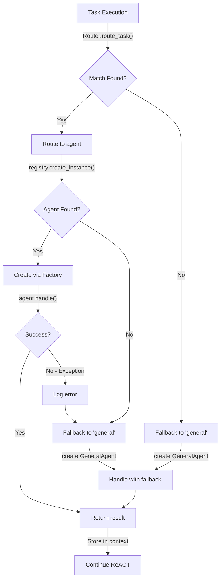
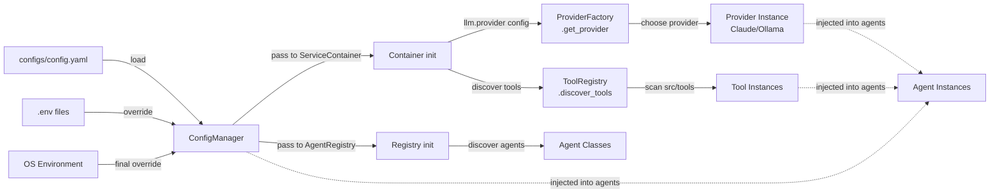

# System Architecture & Message Flow Diagrams

## 1. Component Architecture Diagram



---

## 2. Message Flow Diagram (Single Turn)

```mermaid
sequenceDiagram
    actor User
    participant Main as main.py
    participant Manager as AgentManager
    participant Orch as Orchestrator
    participant ReACT as ReACTLoop
    participant Plan as Planner
    participant Exec as Executor
    participant Router as Router
    participant Reg as AgentRegistry
    participant Factory as AgentFactory
    participant Agent as Agent Instance
    participant Provider as LLM Provider

    User->>Main: user message
    Main->>Manager: handle(message)
    activate Manager

    Manager->>Orch: run(goal=message, session_id)
    activate Orch

    Orch->>Memory: get_history(session_id)
    Memory-->>Orch: memory_context

    Orch->>ReACT: run(provider, goal, context)
    activate ReACT

    loop ReACT Cycle
        ReACT->>ReACT: reasoning phase
        ReACT->>Provider: chat_completion(reasoning_prompt)
        Provider-->>ReACT: reasoning output

        ReACT->>Plan: create_plan(goal)
        Plan-->>ReACT: Task[]

        ReACT->>Exec: execute_task(task)
        activate Exec

        Exec->>Router: route_task(task)
        Router-->>Exec: agent_name, confidence

        Exec->>Reg: create_instance(agent_name)
        activate Reg

        Reg->>Reg: lookup agent class
        Reg->>Factory: create(agent_class)
        activate Factory

        Factory->>Factory: inspect constructor
        Factory->>Factory: resolve dependencies
        Factory-->>Reg: agent_instance
        deactivate Factory

        Reg-->>Exec: agent_instance
        deactivate Reg

        Exec->>Agent: handle(task, context)
        activate Agent

        Agent->>Provider: chat_completion(prompt)
        Provider-->>Agent: response

        Agent-->>Exec: result
        deactivate Agent

        Exec->>context: store result
        Exec-->>ReACT: task_result
        deactivate Exec
    end

    ReACT-->>Orch: execution_results[]
    deactivate ReACT

    Orch->>Orch: synthesize(goal, results)
    Orch->>Memory: store_exchange(goal, response)
    Orch-->>Manager: final_response
    deactivate Orch

    Manager-->>User: response
    deactivate Manager
```



---

## 3. Agent Discovery & Routing Flow

```mermaid
graph LR
    subgraph "Startup"
        A["AgentRegistry<br/>discovers agents"]
        A -->|"scan src/agents/"| B["Import modules:<br/>general_agent<br/>weather_agent"]
        B -->|"inspect classes"| C["Find BaseAgent<br/>subclasses"]
        C -->|"extract metadata"| D["Build agents map:<br/>general →<br/>weather_agent →"]
    end

    subgraph "Router Initialization"
        E["AgentManager<br/>builds router"]
        E -->|"read agent metadata"| F["Create agent_capabilities<br/>dict from classes"]
        F -->|"pass to Router"| G["Router stores<br/>keyword patterns<br/>by capability"]
    end

    subgraph "Message Routing"
        H["User message"]
        H -->|"normalize & score"| I["Keywords match?"]
        I -->|"yes"| J["Route to<br/>matched agent"]
        I -->|"no"| K["Route to<br/>fallback<br/>general"]
        J -->|"agent_name"| L["Executor calls<br/>registry.create_instance"]
        K -->|"agent_name=general"| L
        L -->|"lookup class"| M["Create agent<br/>via Factory"]
        M -->|"inject deps"| N["Agent instance<br/>ready to handle"]
    end

    D --> E
    G --> H
```



---

## 4. Dependency Injection Flow



---

## 5. Data Flow Through System

### Request Path (Input → Output)

```
┌─────────────────────────────────────────────────────────────────┐
│                        USER INPUT                               │
│                   "What's the weather?"                          │
└──────────────────────┬──────────────────────────────────────────┘
                       │
                       ▼
┌─────────────────────────────────────────────────────────────────┐
│                    AgentManager.handle()                         │
│  ┌───────────────────────────────────────────────────────────┐  │
│  │ • Set correlation_id for tracing                          │  │
│  │ • Log request metadata (length, id)                       │  │
│  └───────────────────────────────────────────────────────────┘  │
└──────────────────────┬──────────────────────────────────────────┘
                       │
                       ▼
┌─────────────────────────────────────────────────────────────────┐
│               Orchestrator.run()                                │
│  ┌───────────────────────────────────────────────────────────┐  │
│  │ • Retrieve memory (conversation history)                  │  │
│  │ • Create ExecutionContext (session_id, goal, memory)      │  │
│  │ • Initialize completed_tasks tracking                     │  │
│  └───────────────────────────────────────────────────────────┘  │
└──────────────────────┬──────────────────────────────────────────┘
                       │
                       ▼
┌─────────────────────────────────────────────────────────────────┐
│              ReACTLoop.run()                                    │
│  ┌───────────────────────────────────────────────────────────┐  │
│  │ CYCLE 1:                                                  │  │
│  │ • Reasoning: "I need weather info, routing to weather"    │  │
│  │ • Planning: Create Task(description, id, deps)           │  │
│  │ • Observation: Execute and get result                     │  │
│  │                                                            │  │
│  │ CYCLE 2+ (if needed):                                     │  │
│  │ • Re-reason if observation incomplete                     │  │
│  └───────────────────────────────────────────────────────────┘  │
└──────────────────────┬──────────────────────────────────────────┘
                       │
                       ▼
┌─────────────────────────────────────────────────────────────────┐
│            Executor.execute_task()                              │
│  ┌───────────────────────────────────────────────────────────┐  │
│  │ 1. Router.route_task(task)                                │  │
│  │    → "weather_agent" with 0.85 confidence                 │  │
│  │                                                            │  │
│  │ 2. AgentRegistry.create_instance("weather_agent")         │  │
│  │    → Lookup class, call Factory                           │  │
│  │                                                            │  │
│  │ 3. AgentFactory.create(WeatherAgent)                      │  │
│  │    → Introspect: needs config, provider, weather_tool     │  │
│  │    → Resolve and inject all dependencies                  │  │
│  │    → Return initialized WeatherAgent                      │  │
│  │                                                            │  │
│  │ 4. agent.handle(task, context)                            │  │
│  │    → Extract city from task description                   │  │
│  │    → Call weather_tool.get_temperature()                  │  │
│  │    → Call provider.chat_completion() for summary          │  │
│  │    → Return "Sunny, 72°F"                                 │  │
│  │                                                            │  │
│  │ 5. context.completed_tasks[task.id] = result              │  │
│  └───────────────────────────────────────────────────────────┘  │
└──────────────────────┬──────────────────────────────────────────┘
                       │
                       ▼
┌─────────────────────────────────────────────────────────────────┐
│         Orchestrator.synthesize()                               │
│  ┌───────────────────────────────────────────────────────────┐  │
│  │ • Combine all task results                                │  │
│  │ • Create final prompt with results                        │  │
│  │ • Call provider.chat_completion() for synthesis           │  │
│  │ • Return coherent final response                          │  │
│  └───────────────────────────────────────────────────────────┘  │
└──────────────────────┬──────────────────────────────────────────┘
                       │
                       ▼
┌─────────────────────────────────────────────────────────────────┐
│              Memory.store_exchange()                            │
│  ┌───────────────────────────────────────────────────────────┐  │
│  │ • Store user message in history                           │  │
│  │ • Store AI response in history                            │  │
│  │ • Associate with session_id for retrieval                 │  │
│  └───────────────────────────────────────────────────────────┘  │
└──────────────────────┬──────────────────────────────────────────┘
                       │
                       ▼
┌─────────────────────────────────────────────────────────────────┐
│                      FINAL RESPONSE                             │
│                 "Sunny, 72°F, nice day!"                        │
└─────────────────────────────────────────────────────────────────┘
```

---

## 6. Message Structure Through Pipeline

### Initial Message
```python
message: str = "What's the weather in Seattle?"
```

### In Orchestrator
```python
ExecutionContext(
    session_id="uuid-1234",
    goal="What's the weather in Seattle?",
    memory=[
        {"role": "user", "content": "What's the weather in Seattle?"},
    ],
    completed_tasks={},
    metadata={},
)
```

### In Planner
```python
Task(
    id="task-001",
    description="What's the weather in Seattle?",
    assigned_agent=None,  # Will be assigned by router
    dependencies=[],
    parallelizable=False,
    status=TaskStatus.PENDING,
    result=None,
)
```

### In Router
```python
# Message routing logic:
normalized = "what's the weather in seattle?"
scores = {"weather_agent": 25.0}  # "weather" keyword match
agent_name, confidence = "weather_agent", 0.85
```

### In Agent
```python
# WeatherAgent.handle(task, context)
# Internal processing:
city = "Seattle"  # extracted from task.description
weather_data = {
    "city": "Seattle",
    "temperature": 72,
    "description": "Sunny",
    "humidity": 60,
}
response = "It's 72°F and sunny in Seattle"
```

### In Executor
```python
# Task completion:
task.status = TaskStatus.COMPLETED
task.result = "It's 72°F and sunny in Seattle"
context.completed_tasks["task-001"] = "It's 72°F and sunny in Seattle"
```

### Final Output
```python
"It's 72°F and sunny in Seattle – perfect day for outdoor activities!"
```

---

## 7. Key Component Interactions Matrix

| Source | Target | Data Passed | When |
|--------|--------|-------------|------|
| User | AgentManager | `goal: str` | On each request |
| AgentManager | Orchestrator | `goal, session_id` | Request start |
| Orchestrator | ReACTLoop | `provider, goal, context` | Plan execution |
| ReACTLoop | Planner | `goal, reasoning` | Each cycle |
| Planner | ReACTLoop | `Task[]` | After planning |
| ReACTLoop | Executor | `Task, context` | Task execution |
| Executor | Router | `Task` | Agent selection |
| Router | AgentRegistry | `agent_name` lookup | Route confirmation |
| AgentRegistry | AgentFactory | `agent_class` | Instance creation |
| AgentFactory | Agent | Constructor kwargs | Agent init |
| Agent | Provider | `messages, system_prompt` | LLM calls |
| Provider | Agent | `response: str` | After generation |
| Agent | Executor | `result: str` | Task completion |
| Executor | ReACTLoop | `result, status` | Observation |
| Orchestrator | Memory | `goal, response` | Exchange storage |

---

## 8. Error Handling & Fallback Paths



---

## 9. Configuration & Dependency Resolution



---

## Component State Management

### ExecutionContext Lifecycle
```python
ExecutionContext(
    session_id="unique-id",
    goal="user goal",
    memory=[...],           # Immutable, from history
    completed_tasks={},     # Mutable, accumulates results
    metadata={},           # Mutable, tracking info
)

# During execution:
context.completed_tasks["task-1"] = "result-1"
context.completed_tasks["task-2"] = "result-2"

# At end:
# Used for synthesis & memory storage
```

### Task Lifecycle
```python
Task(
    id="task-1",
    description="...",
    status=PENDING → RUNNING → COMPLETED/FAILED
)

# On completion:
task.result = "..."  # Stored for synthesis
```

---

## Message Payload Examples

### Weather Query Example
```
INPUT: "What's the weather in New York?"

→ ExecutionContext
  session_id: "abc-123"
  goal: "What's the weather in New York?"

→ Task
  description: "What's the weather in New York?"
  assigned_agent: "weather_agent"  (from router)

→ WeatherAgent receives
  task.description: "What's the weather in New York?"
  context.memory: [previous exchanges]

→ WeatherAgent processes
  city: "New York"  (extracted)
  weather_data: {temp: 68, condition: "Cloudy"}

→ Result: "It's 68°F and cloudy in New York"

→ Final Response: "It's 68°F and cloudy in New York. You might want a light jacket!"
```

### Fallback Example
```
INPUT: "Hello there"

→ Router: No weather keywords, no specific agent matches
  → Returns ("general", 0.0)

→ Executor: Creates GeneralAgent instance
  → GeneralAgent is fallback handler

→ GeneralAgent.handle()
  → Calls provider: "You are a helpful assistant. User said: Hello there"

→ Result: "Hello! How can I help you today?"

→ Final Response: "Hello! How can I help you today?"
```
