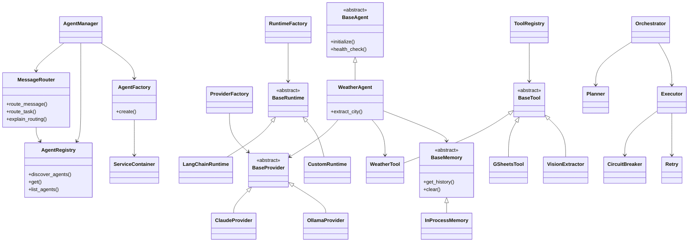

# EM AI Labs — Updated Architecture & Class Diagram

## Repository Overview

This repository implements a modular AI agent platform with:

* Multi-agent orchestration
* Dynamic provider/runtime abstraction
* Dependency injection container
* Tool registry and extensible tools
* Middleware support (retry/circuit breaker)
* Runtime abstraction (LangChain/custom)
* Memory abstraction
* Routing and orchestration layers

The architecture is organized around clean separation of concerns:

| Layer         | Responsibility                         |
| ------------- | -------------------------------------- |
| Agents        | Domain-specific execution logic        |
| Providers     | LLM backend implementations            |
| Runtimes      | Execution/runtime abstraction          |
| Tools         | External capabilities and integrations |
| Orchestration | Planning + execution coordination      |
| Middleware    | Reliability and resiliency             |
| Memory        | Conversation/history storage           |
| Core          | Dependency injection container         |
| Utils         | Logging, config, observability         |

---

# High-Level Architecture

```text
+---------------------------------------------------------+
|                     Application Entry                    |
|                main.py / AgentManager                    |
+---------------------------+-----------------------------+
                            |
                            v
+---------------------------------------------------------+
|                      Message Router                      |
|               Intent / keyword routing                   |
+---------------------------+-----------------------------+
                            |
                            v
+---------------------------------------------------------+
|                     Agent Registry                       |
|              Dynamic discovery + lookup                  |
+---------------------------+-----------------------------+
                            |
                            v
+---------------------------------------------------------+
|                      Agent Factory                       |
|         Dependency-aware agent construction              |
+---------------------------+-----------------------------+
                            |
                            v
+---------------------------------------------------------+
|                        Agents                            |
|         WeatherAgent / Future Specialized Agents         |
+---------------------------+-----------------------------+
                            |
        +-------------------+-------------------+
        |                   |                   |
        v                   v                   v
+---------------+   +---------------+   +---------------+
|   Providers   |   |    Tools      |   |    Memory     |
| Claude/Ollama |   | Weather/etc   |   | InProcess     |
+---------------+   +---------------+   +---------------+
        |
        v
+---------------------------------------------------------+
|                        Runtime                           |
|             LangChainRuntime / CustomRuntime             |
+---------------------------------------------------------+
```

---

# Core Architectural Decisions

## 1. Dependency Injection Container

`src/core/container.py`

The repository uses a lightweight service container (`ServiceContainer`) to centralize dependency creation and lifecycle management.

### Responsibilities

* Shared dependency ownership
* Provider reuse
* Configuration distribution
* Avoiding manual wiring everywhere
* Improving testability

### Recommended Usage

The container should:

* Own shared infrastructure dependencies
* Build providers, runtimes, registries, and tools
* Be passed into factories instead of exposing globals

### Anti-Patterns To Avoid

* Agents directly importing the container
* Global singleton service locators
* Creating nested containers inside registries/factories
* Runtime dependency introspection everywhere

---

# Main Components

## AgentManager

File: `src/agent_manager.py`

Top-level application coordinator.

### Responsibilities

* Bootstraps application services
* Initializes registries/factories
* Validates startup state
* Coordinates overall application lifecycle

---

## MessageRouter

File: `src/router.py`

Routes incoming tasks/messages to appropriate agents.

### Current Routing Strategies

* Keyword scoring
* Regex pattern matching
* Availability checks

### Future Improvements

* Embedding-based routing
* Intent classification models
* Multi-agent routing confidence
* Hierarchical routing

---

## AgentRegistry

File: `src/agents/agent_registry.py`

Dynamic discovery and registration of agents.

### Responsibilities

* Discover agent modules
* Register available agents
* Lookup by name/type
* Support pluggable architecture

### Design Strength

Keeps orchestration decoupled from concrete agent implementations.

---

## AgentFactory

File: `src/agents/agent_factory.py`

Centralized agent construction layer.

### Responsibilities

* Dependency-aware agent creation
* Provider injection
* Tool injection
* Runtime injection
* Config-based assembly

### Recommended Direction

Instead of reflection-heavy constructor inspection everywhere, prefer:

* Explicit dependency contracts
* Typed constructor dependencies
* Container-managed composition

This keeps complexity manageable as agents scale.

---

# Agent Layer

## BaseAgent

File: `src/agents/base_agent.py`

Abstract base class for all agents.

### Responsibilities

* Common initialization flow
* Health checks
* Shared config access
* Lifecycle management
* Error abstraction

### Current Error Hierarchy

```text
AgentError
 ├── AgentInitError
 └── AgentExecutionError
```

---

## WeatherAgent

File: `src/agents/weather_agent.py`

Example domain agent.

### Responsibilities

* Weather-specific task execution
* City extraction
* Weather provider coordination

### Architectural Observation

This is a good reference implementation for future agents because it demonstrates:

* Dependency injection
* Encapsulated domain logic
* Provider/tool separation
* Error specialization

---

# Provider Layer

Directory: `src/providers`

## Purpose

Abstracts underlying LLM providers.

### Current Providers

| Provider        | Purpose                  |
| --------------- | ------------------------ |
| ClaudeProvider  | Anthropic integration    |
| OllamaProvider  | Local model runtime      |
| BaseProvider    | Common provider contract |
| ProviderFactory | Provider construction    |

### Benefits

* Provider swapping
* Local vs hosted execution
* Unified inference interface
* Easier testing/mocking

---

# Runtime Layer

Directory: `src/runtimes`

## Purpose

Execution abstraction between orchestration and providers.

### Current Runtime Types

| Runtime          | Purpose               |
| ---------------- | --------------------- |
| LangChainRuntime | LangChain integration |
| CustomRuntime    | Native execution path |
| BaseRuntime      | Runtime contract      |
| RuntimeFactory   | Runtime creation      |

### Architectural Benefit

Separates:

* LLM provider concerns
* Orchestration concerns
* Framework-specific execution

This prevents framework lock-in.

---

# Tooling Layer

Directory: `src/tools`

## Purpose

External capability integration.

### Current Tools

| Tool            | Purpose                     |
| --------------- | --------------------------- |
| WeatherTool     | Weather data retrieval      |
| GSheetsTool     | Google Sheets integration   |
| VisionExtractor | Vision extraction workflows |
| ToolRegistry    | Tool management             |

### Design Pattern

Tools follow a plugin-like architecture:

```text
BaseTool
   ↓
Concrete Tools
   ↓
ToolRegistry
```

### Recommendation

As the tool ecosystem grows:

* Add capability metadata
* Add tool permissions
* Add execution tracing
* Add async execution support

---

# Orchestration Layer

Directory: `src/orchestration`

## Components

| Component    | Purpose                     |
| ------------ | --------------------------- |
| Orchestrator | High-level coordination     |
| Planner      | Task planning               |
| Executor     | Execution pipeline          |
| Models       | Shared orchestration models |

### Recommended Future Direction

This layer can evolve into:

* Multi-step workflows
* DAG execution
* Agent collaboration
* Reflection loops
* Planning/replanning
* Streaming execution

---

# Middleware Layer

Directory: `src/middleware`

## CircuitBreaker

Implements resilience patterns for unreliable downstream systems.

### States

```text
CLOSED -> OPEN -> HALF_OPEN
```

## Retry

Provides retry handling for transient failures.

### Strength

Good production-oriented reliability foundation.

---

# Memory Layer

Directory: `src/memory`

## Purpose

Conversation and execution memory abstraction.

### Current Implementation

| Memory Type     | Purpose                  |
| --------------- | ------------------------ |
| BaseMemory      | Abstract contract        |
| InProcessMemory | In-memory implementation |

### Recommended Expansion

Potential future implementations:

* Redis memory
* Vector memory
* Session memory
* Long-term memory
* Semantic retrieval memory

---

# Logging & Observability

Directory: `src/utils`

## Strengths Already Present

* Structured logging
* PII filtering
* Correlation IDs
* Rotating handlers
* Production-oriented logging utilities

### Recommendation

Add:

* OpenTelemetry traces
* Metrics export
* Request spans
* Agent execution timelines

---

# Updated Class Diagram



---

# Current Architectural Strengths

## Strong Separation of Concerns

The repository already demonstrates good layering:

* Agents are isolated
* Providers are abstracted
* Runtimes are replaceable
* Tools are modular
* Middleware is reusable

---

## Extensibility

The architecture is well-positioned for:

* Additional agents
* More providers
* New runtimes
* Tool ecosystems
* Advanced orchestration

---

## Production Readiness Foundations

You already have:

* Structured logging
* Circuit breaking
* Retry handling
* Config abstraction
* Test structure
* Registry/factory separation

These are strong enterprise patterns.

---

# Recommended Next Refactors

## 1. Simplify Dependency Flow

Current direction risks drifting into excessive dynamic introspection.

Recommended:

```python
class WeatherAgent(BaseAgent):
    def __init__(
        self,
        provider: BaseProvider,
        weather_tool: WeatherTool,
        memory: BaseMemory,
    ):
        ...
```

Prefer explicit contracts over reflection-heavy factories.

---

## 2. Keep Container at Composition Root

Recommended ownership:

```text
main.py
  -> container
      -> registries
      -> factories
      -> runtimes
      -> providers
```

Avoid agents/registries creating their own containers.

---

## 3. Introduce Typed Interfaces

Potential additions:

* Protocols/interfaces
* Dependency contracts
* Tool capability schemas
* Runtime execution contracts

---

## 4. Add Async-First Architecture

As orchestration grows:

* async providers
* concurrent tool execution
* streaming responses
* async orchestration pipelines

will become increasingly important.

---

# Suggested Future Architecture Evolution

## Near-Term

* Better DI boundaries
* Cleaner orchestration abstractions
* Async execution
* Typed dependency contracts

## Mid-Term

* Multi-agent workflows
* Planning DAGs
* Memory retrieval systems
* Observability/tracing
* Tool capability negotiation

## Long-Term

* Autonomous orchestration
* Agent collaboration graphs
* Reflection/self-correction
* Distributed execution
* Stateful execution engines

---

# Overall Assessment

This repository already has the foundation of a strong enterprise-style AI orchestration platform.

The biggest architectural risk currently is over-generalizing factories/container interactions too early.

The strongest direction is:

* Explicit dependencies
* Simple composition roots
* Clear ownership boundaries
* Lightweight DI
* Stable abstractions

The existing modular structure is solid and scalable if complexity is introduced gradually.
